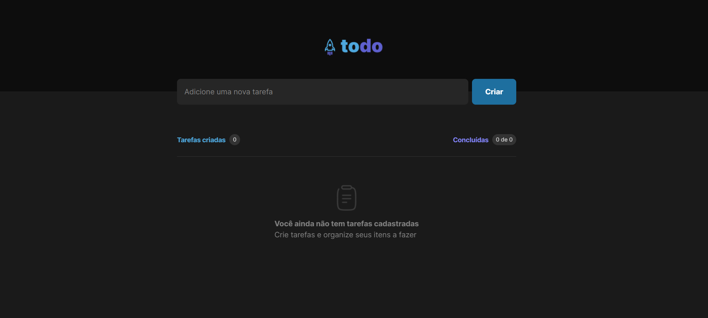
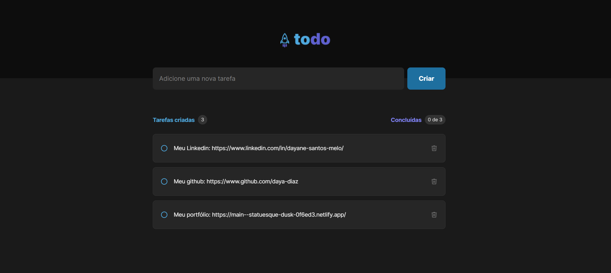

# To-do List

## Descrição
Este projeto surgiu como um desafio proposto pela equipe da RocketSeat durante o curso de ReactJS. Trata-se de uma aplicação de controle de tarefas no estilo to-do list, desenvolvida para auxiliar os usuários na organização de suas atividades diárias.

## Instruções de Instalação
Para instalar e executar o projeto localmente, siga os passos abaixo:

1. Certifique-se de ter o Node.js instalado em seu sistema.
2. Clone este repositório para o seu ambiente local.
3. Na pasta raiz do projeto, execute o comando `npm install` para instalar todas as dependências.
4. Após a instalação das dependências, execute `npm run dev` para iniciar o servidor de desenvolvimento.
5. Abra o seu navegador e acesse `http://localhost:5173` para visualizar a aplicação.

## Instruções de Uso
Para utilizar a Aplicação, siga estas instruções:

- Clique no campo "Adicione uma nova tarefa".
- Digite a tarefa que você deseja, clique em "Criar" ou aperte "Enter" no teclado.
- Para marcar o Todo como finalizado, basta clicar no checkbox no canto esquerdo do Todo.
- Para excluir um Todo, clique no ícone de lixeira no canto direito do Todo.

## Tecnologias Utilizadas
Este projeto foi desenvolvido utilizando as seguintes tecnologias:

- ReactJS
- Vite
- TailwindCSS
- TypeScript

---

Agradeço pelo interesse em meu projeto! Se precisar de suporte ou tiver alguma dúvida, não hesite em entrar em contato. 

Atenciosamente,
Dayane Santos
